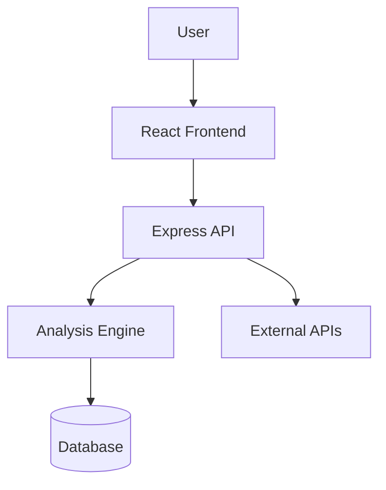

# VerifyIt

> Helping users understand the trustworthiness of websites and links through analysis and educational insights.


---

# Overview


VerifyIt adalah aplikasi yang bertujuan membantu pengguna mengevaluasi tingkat kepercayaan suatu website atau tautan.

Alih-alih hanya memberikan skor, VerifyIt juga berusaha menjelaskan alasan di balik hasil analisis dan memberikan edukasi agar pengguna dapat memahami indikator keamanan suatu website.

> **Catatan:** Penjelasan ini merupakan gambaran umum berdasarkan deskripsi proyek. Detail implementasi akan diperbarui setelah analisis source code.

---

# Problem Statement

Banyak pengguna internet mengalami kesulitan membedakan website yang aman dan website yang berpotensi:

- phishing
- scam
- malware
- fake store
- fake login page

VerifyIt bertujuan membantu pengguna mengambil keputusan dengan lebih percaya diri melalui analisis yang mudah dipahami.

---

# Target Users

- Pengguna umum
- Mahasiswa
- Pekerja
- UMKM
- Developer
- Tim keamanan internal

---

# Features

> Akan diperbarui sesuai source code.

Contoh:

- Website URL Analysis
- Trust Score
- Risk Indicators
- AI Explanation (Rencana)
- Educational Recommendations
- History Analysis

---

# Project Workflow

```text
User
   │
   ▼
Input URL
   │
   ▼
Frontend Validation
   │
   ▼
Backend API
   │
   ▼
Website Analysis
   │
   ▼
Generate Result
   │
   ▼
Display Score + Explanation
```

---

# Architecture



---

# Frontend Architecture

Belum dapat dipastikan dari source code.

Kemungkinan akan terdiri dari:

- Pages
- Components
- Assets
- Constants
- Features

---

# Backend Architecture

Belum dapat dipastikan dari source code.

Kemungkinan terdiri dari:

- Routes
- Controllers
- Services
- Models
- Middleware
- Database Layer

---

# Tech Stack

| Technology | Purpose | Status |
|------------|----------|---------|
| React | UI | Digunakan |
| TypeScript | Type Safety | Digunakan |
| Vite | Build Tool | Digunakan |
| Tailwind CSS | Styling | Digunakan |
| Node.js | Runtime | Digunakan |
| Express | Backend API | Belum Dibuat |
| Database | Storage | Belum Dibuat |

---

# API Documentation

## Authentication

| Method | Endpoint | Description |
|---------|----------|-------------|
| POST | /api/auth/login | Login |

---

## Website Analysis

| Method | Endpoint | Description |
|---------|----------|-------------|
| POST | /api/analyze | Analyze URL |

---

## User

| Method | Endpoint | Description |
|---------|----------|-------------|
| GET | /api/profile | User Profile |

---

> Endpoint di atas hanya contoh struktur dokumentasi.

---

# API Flow

```mermaid
sequenceDiagram

User->>Frontend: Submit URL

Frontend->>Backend: POST /analyze

Backend->>Analysis Engine

Analysis Engine-->>Backend

Backend-->>Frontend

Frontend-->>User
```

---

# Authentication Flow

```mermaid
flowchart TD

Login

↓

Validate

↓

Generate JWT

↓

Save Token

↓

Protected API

↓

Response
```

---

# Database

Belum dibuat.

Apabila project menggunakan database maka dokumentasi akan mencakup:

- Schema
- Relationships
- Indexes
- Constraints
- ERD

---

# Environment Variables

```env
PORT=

DATABASE_URL=

JWT_SECRET=

API_KEY=
```

| Variable | Description |
|------------|-------------|
| PORT | Server Port |
| DATABASE_URL | Database Connection |
| JWT_SECRET | JWT Secret |
| API_KEY | External Service |

---

# Installation

## Clone

```bash
git clone https://github.com/Devjack404/Verifyit.git
```

## Install

```bash
pnpm install
```

## Development

```bash
pnpm run dev
```

## Build

```bash
pnpm run build (Belum Jadi)
```

## Production

```bash
npm run start (Belum Jadi)
```

---

# Deployment

Contoh deployment:

- Vercel
- Railway
- Render
- Docker
- VPS

---

# Troubleshooting

## npm install gagal

Solusi:

- Hapus node_modules
- Hapus package-lock.json
- Jalankan kembali npm install

---

## Port sudah digunakan

```bash
lsof -i :3000
```

---

## Database tidak dapat terkoneksi

Periksa:

- DATABASE_URL
- Firewall
- Port Database

---

# FAQ

## Bagaimana menjalankan project?

Ikuti langkah pada bagian Installation.

---

## Bagaimana mengubah endpoint?

Lihat folder routes atau services.

---

## Bagaimana menambah fitur baru?

Gunakan branch baru kemudian buat Pull Request.

---

# Contributing

## Branch Naming

```
feature/login
feature/dashboard

fix/auth

docs/readme
```

---

## Commit Convention

```
feat:

fix:

docs:

style:

refactor:

test:

chore:
```

---

## Pull Request Checklist

- Code sudah berjalan
- Tidak ada error lint
- Dokumentasi diperbarui
- Screenshot ditambahkan bila perlu

---

# Roadmap

- [ ] Authentication
- [ ] Dashboard
- [ ] URL Analysis
- [ ] AI Recommendation
- [ ] History
- [ ] Export Report
- [ ] Admin Panel

---

# License

MIT License

---

# Author

Juan Richard Samarera Sabarofek

---

# Documentation Status

| Section | Status |
|----------|--------|
| Overview | Draft |
| Architecture | Draft |
| API | Placeholder |
| Database | Placeholder |
| Deployment | Draft |
| README | Draft |
| Troubleshooting | Draft |

---

# Notes

Dokumentasi ini merupakan kerangka awal.

Seluruh detail teknis akan diperbarui berdasarkan hasil analisis source code agar dokumentasi sesuai dengan implementasi sebenarnya tanpa membuat asumsi.
